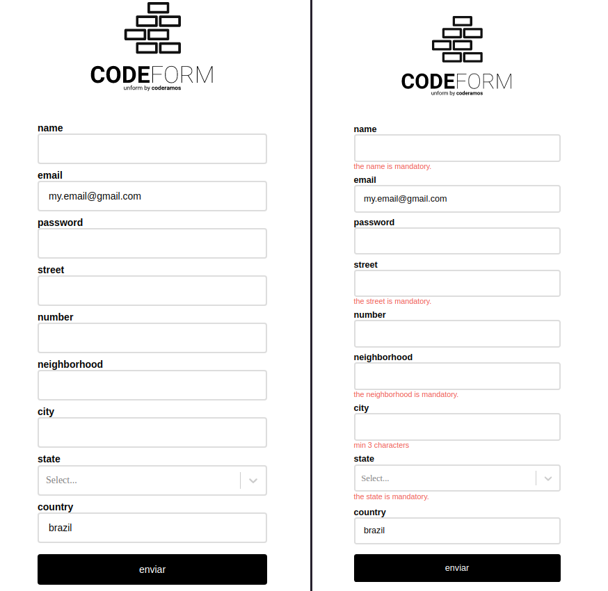

# example | UNFORM



## About This Project

Unform is a performance focused library that helps you creating beautiful forms in React with the power of uncontrolled components performance and [React Hooks](https://pt-br.reactjs.org/docs/hooks-overview.html).
You can learn more in the [Create React App documentation](https://facebook.github.io/create-react-app/docs/getting-started). To learn React, check out the [React documentation](https://reactjs.org/).

## Avaliable Scripts

### Run Project

In the project directory, you can run:

```
yarn install
```

and

```
yarn start
```

Learn how to install `yarn` through the [official documentation](https://yarnpkg.com/pt-BR/docs/install).

Run the app in the development mode by opening [http://localhost:3000](http://localhost:3000) to view it in the browser.

## Main Tecnologies Used

#### [unform](https://unform.dev/)

> To create performance forms.

#### [react-select](https://react-select.com/home)

> To create a flexible and powerful input.

## About Me

My Github profile: https://github.com/coderamos/

My Linkedin profile: https://www.linkedin.com/in/coderamos/
